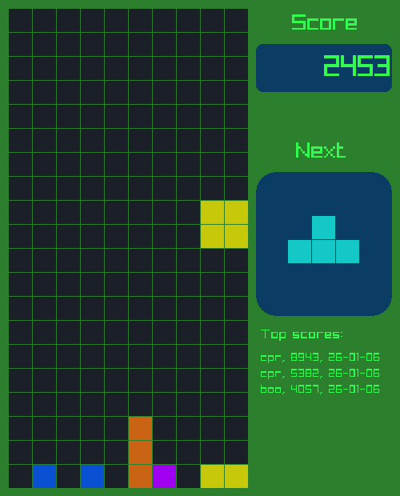
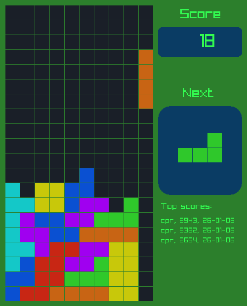
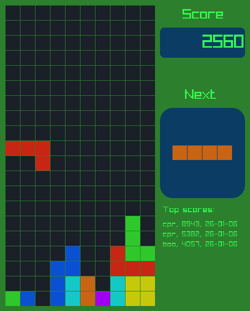
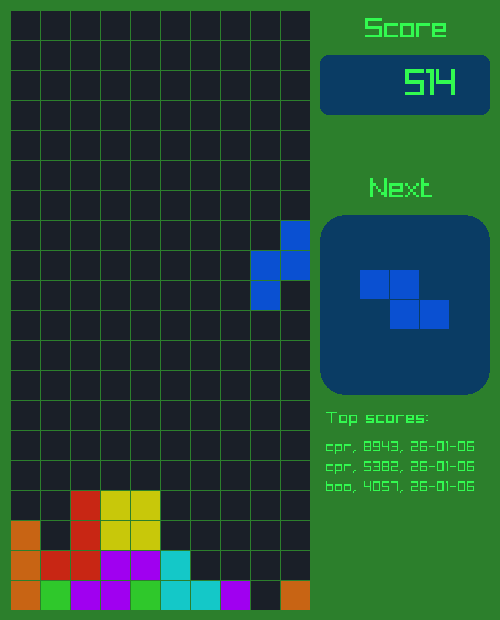
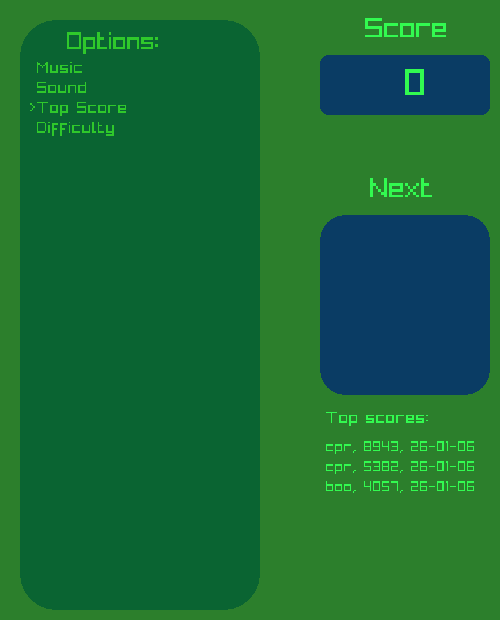
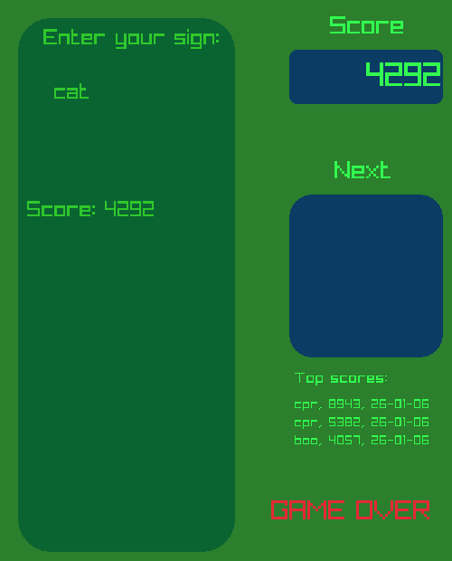
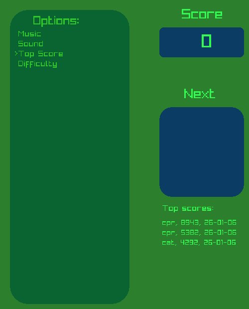
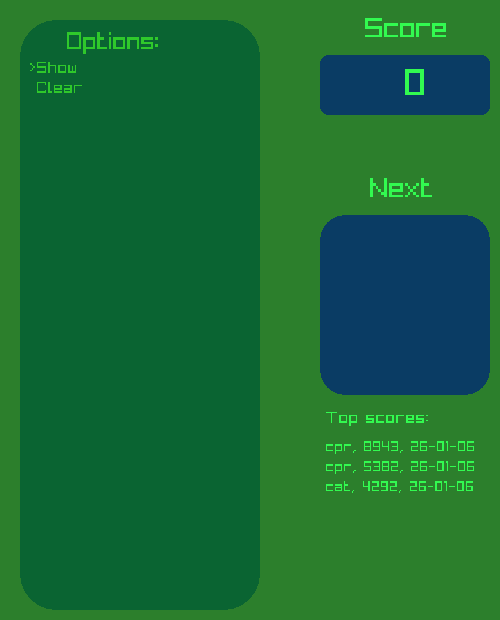
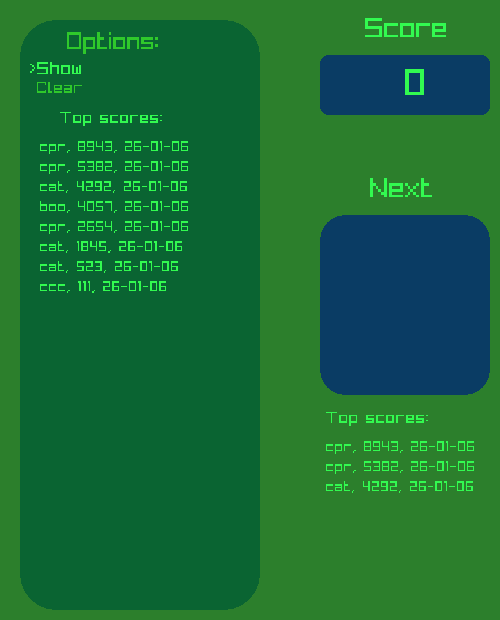

# Tetris (C++ / raylib)

A classic **Tetris implementation in C++ using raylib**, featuring sound, music themes, an in-game pause/options overlay, persistent high scores, and multiple difficulty modes including a progressive speed increase.

This project sticks closely to standard Tetris rules while adding a clean UI, keyboard-driven menus, and audiovisual polish.

---

## Media

<p align="center">
  
</p>

<p align="center">
  
</p>

<p align="center">
  
</p>

<p align="center">
  
</p>

<p align="center">
  
</p>

<p align="center">
  
</p>

<p align="center">
  
</p>

<p align="center">
  
</p>

<p align="center">
  
</p>


## Features

- Classic Tetris gameplay
- Built with **C++ and raylib**
- Keyboard-controlled gameplay and menus
- Pause menu with configurable options
- Multiple music themes and sound toggle
- Persistent top scores (name + date)
- Progressive difficulty mode
- Next-piece preview
- Score tracking and line clear logic

---

## Controls

### Gameplay (Run Mode)

| Key           | Action                          |
|---------------|----------------------------------|
| ← Left        | Move block left                  |
| → Right       | Move block right                 |
| ↓ Down        | Soft drop (hold to accelerate)   |
| ↑ Up / R      | Rotate block clockwise           |
| T             | Rotate block counter-clockwise   |
| Space         | Pause game                       |

Holding **Down** will continuously move the block downward.

---

### Pause Menu

The pause menu overlays the playfield to prevent previewing the current block.

| Key           | Action                |
|---------------|------------------------|
| ↑ Up          | Menu up                |
| ↓ Down        | Menu down              |
| Enter         | Select menu option     |
| Backspace     | Go back                |
| Space         | Resume game            |

---

### Game Over Screen

After game over, players can submit a **3-letter name** for the high score table.

| Key           | Action                         |
|---------------|--------------------------------|
| Any character | Enter initials (A–Z, 0–9)      |
| Enter         | Submit score and restart       |

---

## Options Menu

The options menu is accessible while the game is paused.

### Music
- Theme A
- Theme B
- Theme C
- Off

### Sound
- On
- Off

### Top Scores
- Show
- Clear

### Difficulty
- **Slow**
- **Medium**
- **Fast**
- **Progressive**

---

## Difficulty Modes

The game supports four difficulty levels:

- **Slow** – relaxed drop speed
- **Medium** – standard pace
- **Fast** – increased drop speed
- **Progressive** – drop speed increases as lines are cleared

Progressive mode dynamically increases difficulty using:

```cpp
m_difficulty_factor[3] /= 1.02;
```

This results in a gradually accelerating game as the player clears more lines.


---

## Scoring & Display

During gameplay, the screen displays:

- Current score
- Next block preview
- Top 3 high scores:
    - Player name (3 characters)
    - Score
    - Date (YY-MM-DD)
Scores persist across sessions.

## Technical Notes

Input handling uses GetKeyPressed() and IsKeyDown() from raylib
Menu system is hierarchical and keyboard-driven
Audio playback is paused/resumed automatically when entering or exiting pause mode
Game logic follows standard Tetris rotation, collision, and line-clear rules

## File layout

```
├── logs
│   └── main_log.txt
├── Makefile
├── obj
│   ├── block.o
│   ├── blocks.o
│   ├── c_logger.o
│   ├── colours.o
│   ├── game.o
│   ├── grid.o
│   ├── main.o
│   ├── options.o
│   ├── position.o
│   └── scoring.o
├── scorefile.txt
├── sounds
│   ├── clear1.mp3
│   ├── clear2.mp3
│   ├── clear3.mp3
│   ├── clear4.mp3
│   ├── game_over.mp3
│   ├── pause.mp3
│   ├── rotate.mp3
│   ├── tetris_a.mp3
│   ├── tetris_b.mp3
│   ├── tetris_c.mp3
│   └── unpause.mp3
├── src
│   ├── block.cpp
│   ├── block.h
│   ├── blocks.cpp
│   ├── blocks.h
│   ├── c_logger.cpp
│   ├── c_logger.h
│   ├── colours.cpp
│   ├── colours.h
│   ├── game.cpp
│   ├── game.h
│   ├── grid.cpp
│   ├── grid.h
│   ├── main.cpp
│   ├── options.cpp
│   ├── options.h
│   ├── position.cpp
│   ├── position.h
│   ├── scoring.cpp
│   └── scoring.h
└── tetris
```

## Build & Run

If raylib is installed and properly linked:

Example (Linux):

```bash
g++ -std=c++17 main.cpp -lraylib -o tetris
./tetris
```

(Exact build steps may vary depending on platform and setup.)

## Future Improvements

- Replace magic indices with enums for readability
- Configurable key bindings
- Additional rotation systems (SRS variants)
- Visual effects for line clears
- Replay or demo mode


## License

This project is provided for learning and experimentation purposes.


